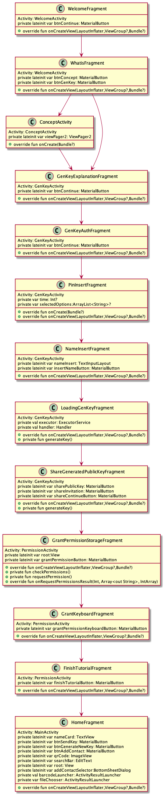
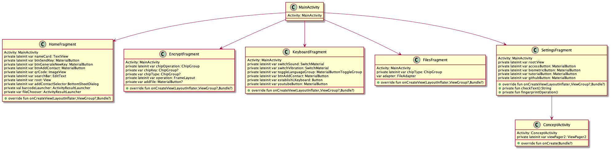
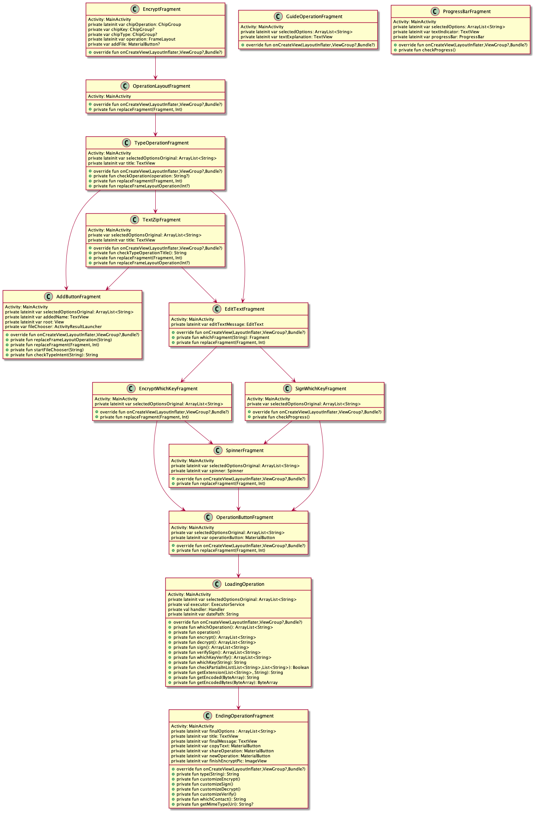

<div id="top"></div>
<!--
*** Thanks for checking out the Best-README-Template. If you have a suggestion
*** that would make this better, please fork the repo and create a pull request
*** or simply open an issue with the tag "enhancement".
*** Don't forget to give the project a star!
*** Thanks again! Now go create something AMAZING! :D
-->


<!-- PROJECT SHIELDS -->
<!--
*** I'm using markdown "reference style" links for readability.
*** Reference links are enclosed in brackets [ ] instead of parentheses ( ).
*** See the bottom of this document for the declaration of the reference variables
*** for contributors-url, forks-url, etc. This is an optional, concise syntax you may use.
*** https://www.markdownguide.org/basic-syntax/#reference-style-links
-->
[![Contributors][contributors-shield]][contributors-url]
[![Forks][forks-shield]][forks-url]
[![Stargazers][stars-shield]][stars-url]
[![Watchers][issues-shield]][issues-url]
[![Twitter][twitter-shield]][twitter-url]
[![Youtube][youtube-shield]][youtube-url]
[![Reddit][reddit-shield]][reddit-url]
[![LinkedIn][linkedin-shield]][linkedin-url]


<!-- PROJECT LOGO -->
<br />
<div align="center">
  <a href="https://github.com/github_username/repo_name">
    
  </a>

<h3 align="center">KeyCip</h3>

  <p align="center">
    <strong>KeyCip</strong> is an Android app that allows users to encrypt, decrypt and sign text, photos, videos and other files. To accomplish this goal, it relies on both <strong>RSA and AES algorithms.</strong> <strong>Sounds to complicated?</strong> Do not worry the workflow in order to make each one of the operations is a step-by-step process (even Youtube tutorials have beeen created). <strong>KeyCip</strong> has been designed to be as easy as posible, introducing mechanisms suchas as fingerprint authentication or QR code scannig for public key sharing. The most important part is that the whole code is available for the community as an open source project, so do not hesitate to colaborate or request any feature. And remember: <strong>Information belongs to us</strong>
    <br />
    <a href="https://github.com/jff99/KeyCip"><strong>Explore the docs »</strong></a>
    <br />
    <br />
    <a href="https://github.com/jff99/KeyCip">View Demo</a>
    ·
    <a href="https://github.com/jff99/KeyCip/issues">Report Bug</a>
    ·
    <a href="https://github.com/jff99/KeyCipe/issues">Request Feature</a>
  </p>
</div>


<!-- TABLE OF CONTENTS -->
<details>
  <summary>Table of Contents</summary>
  <ol>
    <li>
      <a href="#about-the-project">About The Project</a>
      <ul>
        <li><a href="#built-with">Built With</a></li>
      </ul>
    </li>
    <li>
      <a href="#getting-started">Getting Started</a>
      <ul>
        <li><a href="#prerequisites">Prerequisites</a></li>
        <li><a href="#installation">Installation</a></li>
      </ul>
    </li>
    <li><a href="#usage">Usage</a></li>
    <li><a href="#roadmap">Roadmap</a></li>
    <li><a href="#contributing">Contributing</a></li>
    <li><a href="#license">License</a></li>
    <li><a href="#contact">Contact</a></li>
    <li><a href="#acknowledgments">Acknowledgments</a></li>
  </ol>
</details>


<!-- ABOUT THE PROJECT -->
## About The Project

We are all aware that our online information is treated as little more than a commodity. In fact, we have naturalised the heavy fines that the big tech giants receive for abusive use of our data. Nevertheless, I strongly believe that our information belongs to us.

However, it seems that our hands and feet are tied.  Social networks, instant messaging applications or cloud storage are present in our personal and working lives. With it, so is the data we send to these tools, which are monitored by large corporations. Therefore, creating a replacement for each of them seems like an arduous task considering the number of them and the development time it would require. 

The latter leaves us with the only solution: control the information that we share, deciding who can access it. But how is that possible? The truth is that encryption algorithms have been around for 500 years, performing the tasks of encrypting and decrypting information.

So, if there is already a solution, what is the purpose of this application? First of all, you may have been scared when you heard encryption algorithm, don't worry, you are not alone. KeyCip comes to your rescue

<strong>KeyCip</strong> is an application that allows you to <strong>encrypt, decrypt, sign and verify signatures of text, photos, videos and other files</strong> using RSA and AES algorithms. Complicated? The application's greatest virtue is that it has been designed with the aim of making the interface and the whole workflow as simple as possible - so that you don't even need to learn complex security skills!

Still, some concepts to learn:


- ### What does encrypting mean?

  <strong>Encrypting</strong> a text, photo, video or document means to hide its content so that only a specific person can know this information, thus ensuring that when the encrypted text, photo, video or document is sent, its content remains confidential.

- ### What does decrypting mean?

  <strong>Decrypting</strong> a text, photo, video or document is the reverse of encrypting, in other words, the original content is returned to the encrypted file by a certain process.

- ### What does signing mean?

  <strong>Signing</strong> a text, photograph, video or document is similar to signing a letter. The content of the text or file is not changed or hidden but allows the recipient to confirm that the person who sent it to them is indeed the person they claim to be.


The application will guide you through the whole process. In addition, you can also visit our Youtube channel where you will find guides, in case you have any doubts. 

Wait, we have one last surprise. KeyCip has its own keyboard with which text encryption and decryption operations can be used from any application. This way, you can have a private conversation with your friend, partner or family member without even leaving the social network or instant messaging application you are using.

<strong>All of this is part of a Polytechnic University of Madrid, which has been developped by Jorge Fernández Fonseca in collaboration with Sergio Ríos Aguilar</strong>


[]() 
[]() 
[]() 
[]() 
[]() 
[]()
[]() 
[]() 
[]() 

[]() 
[]() 
[]()
[]() 
[]() 
[]() 
[]() 
[]() 
[]() 


<p align="right">(<a href="#top">back to top</a>)</p>


### Built With

* [Kotlin](https://kotlinlang.org/)
* [Android Studio](https://developer.android.com/studio)
* [Adobe Xd](https://www.adobe.com/es/products/xd.html)

<p align="right">(<a href="#top">back to top</a>)</p>


<!-- GETTING STARTED -->
## Getting Started

### Prerequisites
The app has been developped for Android SDK 24 to Android SDK 31. Just make sure to install those SDK in your computer and you are good to go. Android Studio makes everything easier [Android Studio](https://developer.android.com/studio)

### Installation

1. Clone the repo
   ```sh
   git clone https://github.com/jff99/KeyCip.git
   ```
2. Start building something unique (and helpful for the community)

<p align="right">(<a href="#top">back to top</a>)</p>


<!-- USAGE EXAMPLES -->
## Usage

You might feel overwhelmed by the quantity of classes and xml included within the app (I know it, my mind is caotic). In order to help you understand the project, we have prepared some diagrams, which shows how the differente classes are related 






<p align="right">(<a href="#top">back to top</a>)</p>


<!-- ROADMAP -->
## Roadmap

- [ ] Add encryption and decryption of pictures and files through the keyboard (currently only text)
- [ ] Add authentication when encrypting and decrypting through the keyboard
- [ ] Add the possibility to open directly .zip files (instead of browsing for it)
    - [ ] Changing the fragment structure and argument passing
- [ ] Find a solution to share the private key to another device (not depending on the phone)
- [ ] iOs version
- [ ] Computer version


See the [open issues](https://github.com/jff99/KeyCip/issues) for a full list of proposed features (and known issues).

<p align="right">(<a href="#top">back to top</a>)</p>


<!-- CONTRIBUTING -->
## Contributing

Contributions are what make the open source community such an amazing place to learn, inspire, and create. Any contributions you make are **greatly appreciated**.

If you have a suggestion that would make this better, please fork the repo and create a pull request. You can also simply open an issue with the tag "enhancement".
Don't forget to give the project a star! Thanks again!

1. Fork the Project
2. Create your Feature Branch (`git checkout -b feature/AmazingFeature`)
3. Commit your Changes (`git commit -m 'Add some AmazingFeature'`)
4. Push to the Branch (`git push origin feature/AmazingFeature`)
5. Open a Pull Request

<p align="right">(<a href="#top">back to top</a>)</p>


<!-- LICENSE -->
## License

Distributed under the GNU General Public License v3.0 . See `LICENSE.txt` for more information.

<p align="right">(<a href="#top">back to top</a>)</p>


<!-- CONTACT -->
## Contact

Jorge Fernández Fonseca - [@twitter_handle](https://twitter.com/KeyCipApp) [@linkedin_handle](https://www.linkedin.com/in/jorge-fern%C3%A1ndez-fonseca/) - keycip.contact@gmail.com

Sergio Ríos Aguilar - sergio.rios@upm.es

Project Link: [https://github.com/jff99/KeyCip](https://github.com/jff99/KeyCip)

Reddit page: [https://www.reddit.com/r/KeyCip/](https://github.com/jff99/KeyCip)

<p align="right">(<a href="#top">back to top</a>)</p>


<!-- ACKNOWLEDGMENTS -->
## Acknowledgments

* <a href="https://github.com/zxing/zxing">Barcode Zxing reader (public Github repository</a>
* <a href="https://www.baeldung.com/java-aes-encryption-decryption">Java AES Encryption and Decryption</a>
* <a href="https://medium.com/el-acordeon-del-programador/encriptaci%C3%B3n-aes-en-java-ebb81ddf82b">Encriptación AES en Java</a>
* <a href="https://www.alvarodeleon.net/encriptar-y-desencriptar-con-rsa-en-java/">Encriptar y Desencriptar con RSA en JAVA</a>
* <a href="https://www.baeldung.com/java-rsa">RSA in Java</a>
* <a href="https://www.freepik.es/vectores/socializar">Vector de socializar creado por freepik - www.freepik.es</a>
* <a href="https://www.freepik.es/vectores/socializar">Vector de socializar creado por freepik - www.freepik.es</a>
* <a href="https://www.freepik.es/vectores/web">Vector de web creado por storyset - www.freepik.es</a>
* <a href='https://www.freepik.es/vectores/contrato-digital'>Vector de contrato digital creado por vectorjuice - www.freepik.es</a>
* <a href='https://www.freepik.es/vectores/seguridad-datos'>Vector de seguridad de datos creado por jcomp - www.freepik.es</a>
* <a href='https://www.freepik.es/vectores/idea'>Vector de Idea creado por storyset - www.freepik.es</a>
* <a href='https://www.freepik.es/vectores/candado-abierto'>Vector de candado abierto creado por pch.vector - www.freepik.es</a>
* <a href='https://www.freepik.com/vectors/clip-board'>Clip board vector created by jcomp - www.freepik.com</a>
* <a href='https://www.freepik.es/vectores/icono-carpeta'>Vector de icono carpeta creado por rawpixel.com - www.freepik.es</a>
* <a href='https://www.freepik.es/vectores/juventud'>Vector de juventud creado por freepik - www.freepik.es</a>
* <a href='https://www.freepik.es/vectores/seguridad-web'>Vector de seguridad web creado por vectorjuice - www.freepik.es</a>
* <a href='https://www.freepik.es/vectores/brindis-cerveza'>Vector de brindis cerveza creado por pch.vector - www.freepik.es</a>
* <a href='https://www.freepik.es/vectores/decepcionado'>Vector de decepcionado creado por syarifahbrit - www.freepik.es</a>


<p align="right">(<a href="#top">back to top</a>)</p>


<p align="right">(<a href="#top">back to top</a>)</p>


<!-- MARKDOWN LINKS & IMAGES -->
<!-- https://www.markdownguide.org/basic-syntax/#reference-style-links -->
[contributors-shield]: https://img.shields.io/github/contributors/jff99/KeyCip
[contributors-url]: https://github.com/jff99/KeyCip//graphs/contributors
[forks-shield]: https://img.shields.io/github/forks/jff99/KeyCip?style=social
[forks-url]: https://github.com/jff99/KeyCip//network/members
[stars-shield]: https://img.shields.io/github/stars/jff99/KeyCip?style=social
[stars-url]: https://github.com/jff99/KeyCip//stargazers
[issues-shield]: https://img.shields.io/github/watchers/jff99/KeyCip?style=social
[issues-url]: https://github.com/jff99/KeyCip//issues
[twitter-shield]: https://img.shields.io/twitter/follow/KEyCipApp?style=social
[twitter-url]: https://twitter.com/KeyCipApp
[linkedin-shield]: https://img.shields.io/badge/-LinkedIn-black.svg?style=for-the-badge&logo=linkedin&colorB=555
[linkedin-url]: https://www.linkedin.com/in/jorge-fern%C3%A1ndez-fonseca/
[product-screenshot]: images/screenshot.png
[youtube-shield]: https://img.shields.io/youtube/channel/subscribers/UCqvsnBVY6Gwq5VKuy6NfLGQ?style=social
[youtube-url]: https://www.youtube.com/channel/UCqvsnBVY6Gwq5VKuy6NfLGQ
[reddit-shield]: https://img.shields.io/reddit/subreddit-subscribers/KeyCip?style=social
[reddit-url]: https://www.reddit.com/r/KeyCip/
